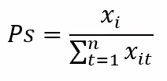
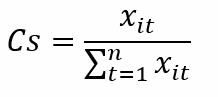

<b>Dashbaord: https://gisag.maps.arcgis.com/apps/opsdashboard/index.html#/3f1a47bafce04c54bebe370b90932748</b>

 
# Excess-Deaths-COVID-19
Monitoring the spread of the emerging Covid-19 pandemic has taken the world by storm. From the initial reports of a novel virus spreading in Wuhan, China, to the Fall of 2020, people around the world have turned to geographic information systems (GIS) and online maps to track its spread. To control the pandemic, scientists have begun to analyze and model the spread of cases to evaluate factors which may influence the rate of growth and predict future spread. Unfortunately, many early Covid-19 cases went undetected due to lack of testing and disparities in access. Additionally, testing rates and efficacy are not consistent across geographies and time. For many reasons, current records of Covid-19 cases represent a biased and considerable under count, negatively impacting predictions and estimates moving forward. We estimate excess deaths using the The CDC National Center for Health Statistics and Provisional Mortality Data and the Provisional COVID-19 Death Counts by Week Ending Data and State to find estimates of excess deaths at a county level.

# Excess Deaths and Methodology
The total number of observed deaths per county from February 1-October 17 2020 calculated using the CDC's National Center for Health Statistics and provisional mortality data. Trends in mortality patterns were estimated using NCHS mortality data from 2012-2018 to determine seasonality values. Expected number of deaths per county were calculated using the MMWR historical data by county and predictions at the upper bound (95%) were tested for accuracy using provincial 2019 totals.

## Observed Deaths 
The number of deaths observed per county per week is a proportion of the state total. The CDC MMWR provides mortality data to the public at the county level. The provisional deaths by county data has been made public and the counts reflect only the dates specified. State reporting times vary and is noted to take several weeks to tabulate final totals, therefore, death counts change frequently as numbers are revised. The counts level off and we determine the point in time where changes to the counts do not increase or decrease by more then 10 percent as the earliest lag time for the state.  Furthermore, the county mortality data begins February 1, 2020 and only includes counties where deaths recorded as COVID-19 number more then 10. As such, many counties are omitted from the dataset. A solution to this issue can be found by using the CDC Daily Updates of Totals by Week and State to de-aggregate the state totals using the average proportion of deaths that fall within each county per week. 
To identify observed deaths at all counties, we developed a de-aggregation method to substitute the missing records. 
### Proportionality 
We calculate the proportionality value to deaggregate state totals into the component parts (counties). We simply calculate the proportion of total state deaths which occur within county per week as follows;

where x is the number of deaths at county (i) for each year (t) over the sum of deaths for all counties within its state. The county average is calculated for 6 years (2012 – 2018) and the average county value is used. 

## Expected Deaths
The expected weekly mortality estimates are calculated using 2012-2018 county level death observations from NCHS. Expected deaths for 2019 is forecasted in R (using ARIMA maximum likelihood approach) in order to assess accuracy of the model results. Mortality values for 2019 is combined with the historical 2012-2018 data and used to predict the expected number of deaths per week for 2020.
### Seasonality 
When given total mortality counts per county, we calculate the expected number of deaths per week using our seasonality value. This county specifc value is derived by using the weekly observations per county over the number of all deaths per year to determine the average number of deaths which occur per week. The average seasonality value for all years (2012-2018) (Cs) used to estimate the expected number of deaths per week per county. The calculation is as follows;

Where x is the number of deaths at county i over the total deaths for all weeks in the year (n). 

## Output Variables
Excess deaths are calculated by the difference in total observed deaths and the expected number for each week in the United States.  Current county totals are derived using the Provisional Death Counts in the United States by County (National Center for Health Statistics - NCHS) of all deaths within the 50 states and the District of Columbia from February 1 onward. This dataset provides total counts of all deaths within each county from Feb 1 onward but does not include counties with fewer than 10 reported COVID-19 deaths.  Weekly state totals provided in the Provisional COVID-19 Death Counts by Week Ending Data and State are used for the remaining counties. 
The expected weekly mortality estimates are calculated using 2012-2018 county level death observations from NCHS. 2019 is forecasted, assessed for accuracy and used to predict expected 2020 weekly totals by county.
Unaccounted deaths include all deaths over expected numbers per county and may reflect deaths which have been 'missed' in the official COVID-19 counts. 

# Input Data Files - Estimation Folder
## 1. prov_
Archive of downloaded Provisional Death Counts in the United States by County. 
Link available: We combine all available weekly reports regarding provisional deaths by county into one database. The input data comes from the weekly updated data file provided by the CDC (CDC Provisional Death Counts by State and County) [https://data.cdc.gov/NCHS/Provisional-COVID-19-Death-Counts-in-the-United-St/kn79-hsxy] 
## 2.	County_Deaths_2012_2018.csv
File is derived from a download of county-level national mortality data from 2012-2018. Data is based on death certificates for united states residents where each certificate contains a single underlying cause of death and additional multiple causes. All counties with fewer than 10 deaths are suppressed for privacy purposes. The mortality data is derived from death certificate information which is filed in all fifty states and the District of Columbia. Data is coded by the states and provided to the NCHS through the Vital Statistics Cooperative Program or coded by NCHS from copies of the original death certificates provided to NCHS by the State registration offices. 
## 3. 3.	Deaths_byWeek 2015_2020
 The input data is derived from the CDC NCHS which provides weekly data on the number of deaths from all causes by jurisdiction of occurrence and age group.  Age groups are combined in the csv. and used for seasonality values and checking for accuracy. 
## 4. DOY_Week.csv
Data table which refers to the Date of year and the week number each day refers to
## 5. Obs_2019.csv & Obs_2019_Weekly.csv
Input data tables used to check for accuracy. Data compiled using CDC Provisional Deaths by week and state, and CDC Provisional Mortality by county. 

# Citation
## Code
Rahman, Md. Ishfaq Ur Excess Deaths by County (2020, December 1). doi: 10.13140/RG.2.2.10056.34566
## Methodology and Works
Panozzo, Kimberly A., Rahman, Md. Ishfaq Ur. Estimation of Excess Deaths During a Global Pandemic. (2020, December 1). 
Panozzo, Kimberly A., Rahman, Md. Ishfaq Ur. Excess Deaths in the United States, A Geographic Approach.(2020, November 30). doi:10.13140/RG.2.2.34504.55046

